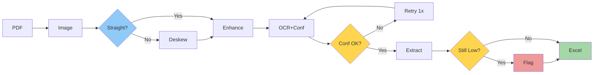

# invoice-ocr-extractor

```mermaid
flowchart LR
    A[PDF] --> B[Image] --> C{Straight?}
    C -->|No| D[Deskew] --> F[Enhance]
    C -->|Yes| F
    F --> G[OCR+Conf] --> H{Conf OK?}
    H -->|No| I[Retry 1x] --> G
    H -->|Yes| K[Extract] --> L{Still Low?}
    L -->|Yes| M[Flag] --> P[Excel]
    L -->|No| P

    style H fill:#ffd54f
    style L fill:#ffd54f
    style C fill:#90caf9
    style M fill:#ef9a9a
    style P fill:#a5d6a7
```