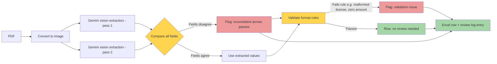

# invoice-ocr-extractor

Extracts structured data from scanned (image-based) medical receipt PDFs and exports it to Excel, with a review log flagging records that need human verification.

## Purpose

Input: a folder of scanned medical receipt PDFs (image-based, not real text — typically photographed rather than flatbed-scanned).
Output:
- `Invoice_Extract.xlsx` — one row per page, with Page, Receipt No., Doctor Name, PRC License, Hospital, Date, Patient Name, Total Amount (PHP), and Signature.
- `review_log.csv` — one row per page, flagging whether it needs human review and why.

## How it works



## Setup

1. **Clone and create a virtual environment**
   ```
   python3 -m venv venv
   source venv/bin/activate
   ```

2. **Install dependencies**
   ```
   pip install -r requirements.txt
   ```

3. **Get a Gemini API key** (free tier, no billing required) from [Google AI Studio](https://aistudio.google.com/), then create your `.env` file:
   ```
   cp .env.example .env
   ```
   Edit `.env` and paste your key:
   ```
   GEMINI_API_KEY=your_actual_key_here
   ```

4. **Add input PDFs**
   Place scanned receipt PDFs in `data/input/`. Any `.pdf` file placed there is picked up automatically — filenames are not hardcoded.

5. **Run**
   ```
   python3 main.py
   ```
   Output appears in `data/output/Invoice_Extract.xlsx` and `data/output/review_log.csv`.

## Known limitations

- Extraction accuracy depends on source image quality. Severely degraded images (heavy blur, glare, low resolution) may still produce plausible-looking but incorrect values that happen to agree across both extraction passes — the consistency check reduces this risk but cannot eliminate it entirely.
- All PDFs in this dataset are single-page; multi-page PDFs are supported (each page is processed and numbered independently) but not yet tested at scale.
- Gemini's free tier has rate limits (requests per minute/day); large batches may need throttling or a paid tier.