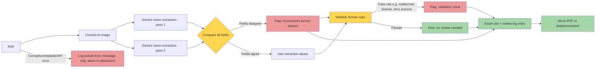

# invoice-ocr-extractor

Extracts structured data from scanned (image-based) medical receipt PDFs and exports it to Excel, with a review log flagging records that need human verification.

## Purpose
Input:
 - a folder of scanned medical receipt PDFs (image-based, not real text — typically photographed rather than flatbed-scanned).

Output:
- `Invoice_Extract.xlsx` — one row per page, with Page, Receipt No., Doctor Name, PRC License, Hospital, Date, Patient Name, Total Amount (PHP), and Signature.
- `review_log.csv` — one row per page, flagging whether it needs human review and why.

Processed:
- successfully processed PDFs are moved from `data/input/` to `data/processed/` after each run — archived, not deleted, so re-running `main.py` won't reprocess the same files.

## How it works



## Setup

1. **Clone the repository**
   ```
   git clone https://github.com/edrian-a-marinas/invoice-ocr-extractor.git
   cd invoice-ocr-extractor
   ```
2. **Copy the environment template and fill in your values**
   ```
   cp .env.example .env
   ```
   ```
   GEMINI_API_KEY=your_actual_key_here
   ```
3. **Create a virtual environment**
   ```
   python3 -m venv venv
   source venv/bin/activate
   ```
4. **Install dependencies**
   ```
   pip install -r requirements.txt
   ```
5. **Add input PDFs**
   Place scanned receipt PDFs in `data/input/`. Any `.pdf` file placed there is picked up automatically.
6. **Run**
   ```
   python3 main.py
   ```

## Known limitations

- Extraction accuracy depends on source image quality. Severely degraded images (heavy blur, glare, low resolution) may still produce plausible-looking but incorrect values that happen to agree across both extraction passes — the consistency check reduces this risk but cannot eliminate it entirely.
- All PDFs in this dataset are single-page; multi-page PDFs are supported (each page is processed and numbered independently) but not yet tested at scale.
- Gemini's free tier has rate limits (requests per minute/day); large batches may need throttling or a paid tier.